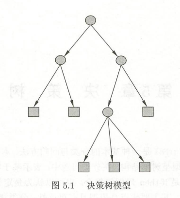
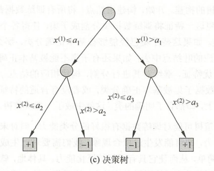
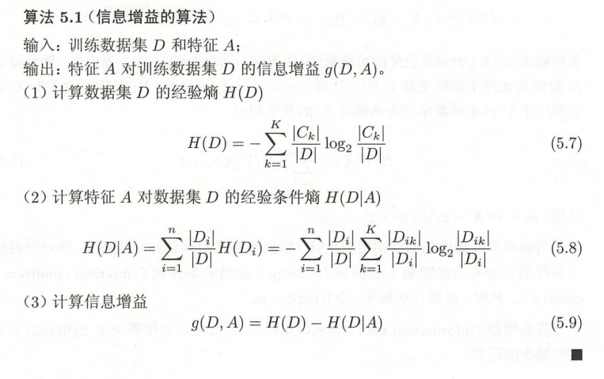
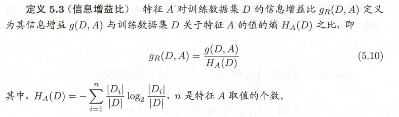
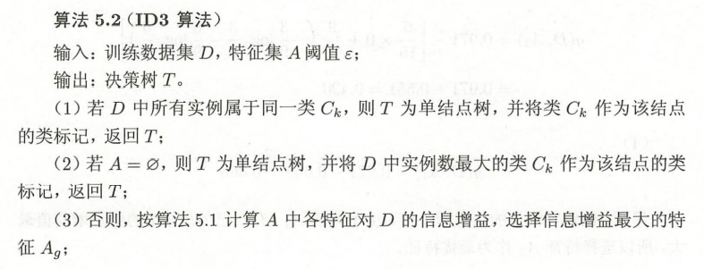
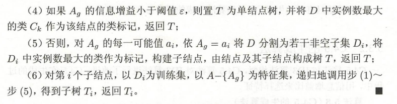
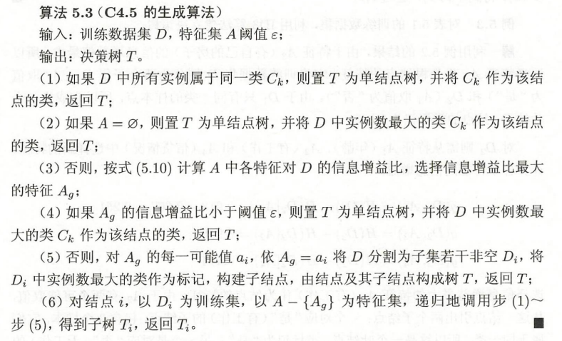

## 决策树（Decision Tree）

决策树是可以做分类也可以做回归的，主要学习的是分类决策树。决策树模型呈树形结构，在分类问题中，表示基于特征对实例进行分类的过程。可以认为是if-then规则的集合，也可以认为是定义在特征空间与类空间上的条件概率分布。

主要优点是模型具有可读性，解释性强，分类速度快。

### 决策树模型

如图，由结点和有向边组成，结点有两种类型，内部节点和叶结点。内部结点表示一个特征或属性，叶结点表示一个类。

**决策树学习**：

本质上是从训练数据集中归纳出一组分类规则。学习算法通常是一个递归得选择最优特征，并根据该特征对训练数据进行分割，使得对各个子数据集有一个最好的分类的过程。这一过程对应着对特征空间的划分，也对应着决策树的构建。一开始所有训练数据都处于根结点，选择一个最优的特征，按照这一特征将训练集进行划分成子集，使得各个子集在当前条件下最好的分类。如果子集能够被基本正确分类，那就构建叶结点；不能就在子集中继续选取最优特征，继续分割，看不能不能构建叶结点，不能就继续割。。。直到训练集都被分割到叶结点中或者没有合适的特征可以作为划分依据为止。这就生成了一颗决策树。

生成了决策树之后，对现有训练数据集的分类来说能力很好，但对未知数据可能就不太好了，可能会出现过拟合现在，所以需要对决策树进行剪枝，也就是合并叶结点，将其父节点退为新的叶结点，让树变得简单。

也就是说，决策树学习算法包含三个过程：**特征选择**、**决策树的生成**和**决策树的剪枝**。决策树的生成只考虑当前最优的情况，也就是局部最优，而剪枝则是考虑全局最优的情况。

### 特征选择

通常特征选择的准则是**信息增益**或**信息增益比**。

#### 信息增益

书上关于**熵**的定义：在信息论与统计概率中，熵（entropy）是表示随机变量不确定性的度量。设X是一个取**有限个值的离散随机变量**，其概率分布为：

$$
P(X=x_i)=p_i,\ i=1,2,...,n
$$

则随机变量X的熵定义为：

$$
H(X)=-\sum_{i=1}^{n}p_i\log p_i
$$

若$p_i=0$，则定义$0\log0=0$。由定义可知，熵只依赖于X的分布，与X的值无关。熵越大，随机变量的不确定性就越大。从定义可验证$0<= H(p) <= \log n$

条件熵$H(Y|X)$表示在已知随机变量X的条件下随机变量Y的不确定性。随机变量X给定的条件下随机变量Y的条件熵（conditional entropy）$H(Y|X)$，定义为X给定条件下Y的条件概率分布的熵对X的数学期望

$$
H(Y|X) = \sum_{i=1}^{n}p_iH(Y|X=x_i)
$$

**信息增益（information gain）**：表示得知特征X的信息而使得类Y的信息的不确定性减少的程度。

特征A对训练数据集D的信息增益$g(D,A)$，定义为集合D的经验熵$H(D)$与特征A给定条件下D的经验条件熵$H(D|A)$之差，即

$$
g(D,A)=H(D)-H(D|A)
$$

信息增益依赖于特征，不同特征往往具有不同的信息增益。信息增益大的特征具有更强分类能力。**根据信息增益准则的特征选择方法是**：对训练集（或子集）D，计算其每个特征的信息增益，并比较它们的大小，选择信息增益最大的特征。

#### 信息增益比

**以信息增益为划分训练数据集的特征，存在偏向于选择取值较多的特征的问题**，使用信息增益比可以对这一问题进行校正。其实就是信息增益多了个分母而已

### 决策树的生成

#### ID3算法

核心是在决策树各个结点上应用**信息增益准则选取特征**，递归构建决策树。具体方法是：从根结点开始，对结点计算所有特征的信息增益，选择信息增益最大的作为结点特征，由该特征的不同取值建立子结点；在对子结点递归调用上面的方法，构建决策树。知道信息增益小于一个阈值或者没有特征可以用了。

相当于用极大似然法进行概率模型的选择（不是很能理解这句话）

#### C4.5的生成算法

C4.5就是把ID3的信息增益换成了信息增益比而已。。。。

### 决策树的剪枝

决策树生成算法递归生成，知道某一条件不能满足，这样生成的决策树对训练集来说很好，但是对未知数据就可能没有多准确，也就是过拟合了。所以需要对复杂的树进行简化，也就是剪枝。

大概就是从已生成的树上裁掉一些子树或叶结点，并将其根结点或父结点作为新的叶结点，从而简化模型。

决策树的剪枝往往通过极小化决策树整体的损失函数或代价函数来实现。

