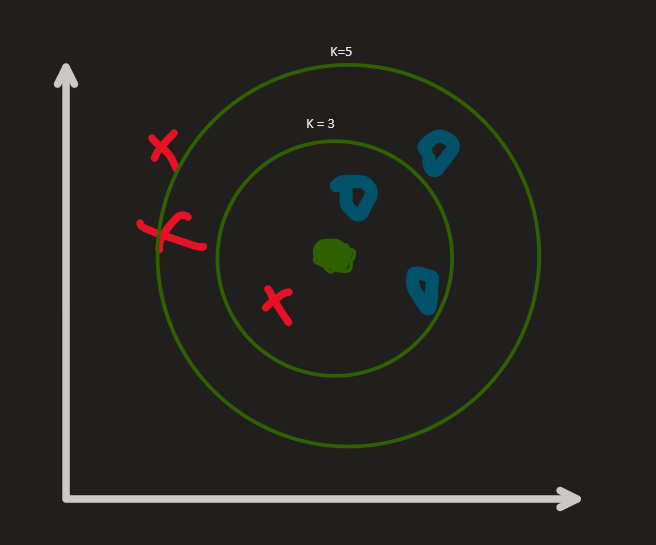
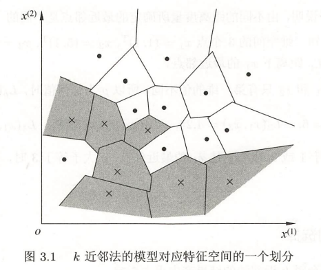
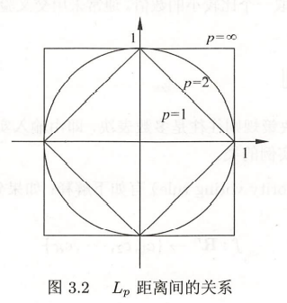
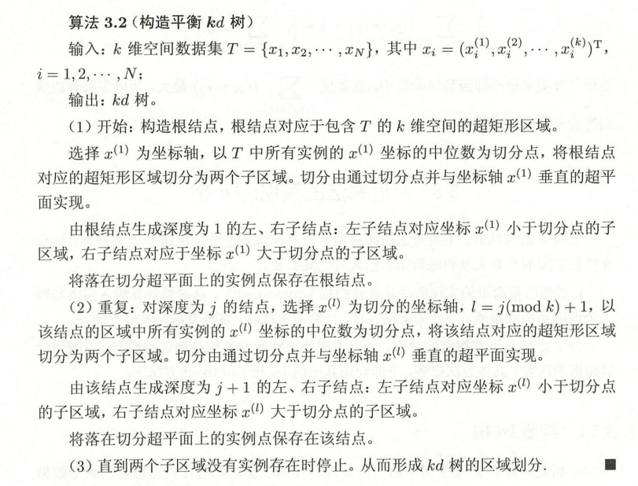
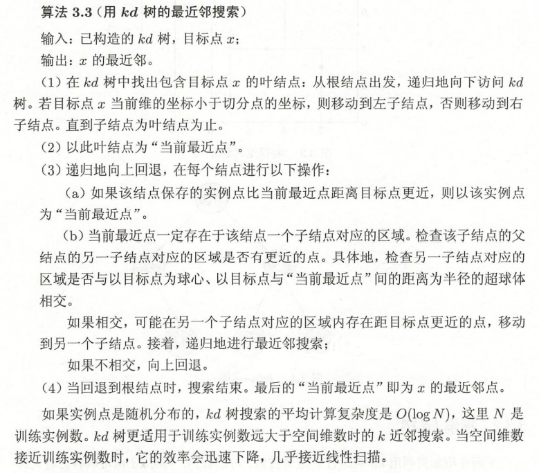

## k-近邻法（k-nearest neighbor, k-NN）

### knn分类的基本思想

knn的其实非常简单直观，直接上图：

图中数据集是两类点，红点和蓝点，要预测的点是绿点。knn的思路是找到距离绿点最近的几个点，然后看这几个点中，属于蓝点的多还是属于红点的多，少数服从多数，如图中k=3的情况下就是被预测为蓝点，k=5也是，这图画的不好。。。具体是距离最近几个点就是看k的取值。

k近邻是没有显式的学习过程的，根据每一次预测数据不同，都要重新计算整一个数据集。

### k近邻模型

knn使用的模型实际上对应于特征空间的划分。模型三要素（注意这里是模型三要素而不是机器学习三要素）**距离度量**、**k值的选择**和**分类决策规则**。

当这三个要素确定之后，对于任何一个新的输入实例，都有唯一确定的一个结果。实际上就是根据这三个要素来建模，也就是划分子空间，在新的点落在哪一块，就属于哪一类别。看书中的图就很好理解：

**距离度量**：

也就是反映两点之间的距离，距离的定义如下

$$
L_2(x_i,x_j)=(\sum_{l=1}^{n}|x_i^{(l)}-x_j^{(l)}|^p)^{\frac{1}{p}}
$$

根据p的不同有几种距离，一种最常见的就是欧氏距离（2范式），也就是高中数学中常常计算的两点之间的直线距离，还有另一种曼哈顿距离（1范式）。也就是把p换成2或者1吧，懒得写了。比较特殊的，当$p=∞$时，它是各个坐标距离的最大值，即

$$
L_∞(x_i,x_j)=\max_l|x_i^{(l)}-x_j^{(l)}|
$$

对于这个图的理解，可以先从我们最熟悉的$p=2$开始，圆上每一点到中心的距离都是一样的，而当是曼哈顿距离时，也就是两个坐标轴的和了，看到正方体的顶角也就是$(0,1)$就得到$0+1=1$，在直线上的中点比如$(0.5,0.5)$也是$0.5+0.5=1$。很好理解。∞的情况也是类似这样的就不废话了，反正用的时候根据公式来就行了

需要注意的就是，如果距离度量的选择不同是有可能造成预测结果不一样的。

**k值的选择**：

k值的选择对预测结果的影响非常大。

k值选择小的情况下，相当于用很小范围的一部分训练集去进行预测，但是如果这部分范围的点如果恰好是噪声，就很可能出错。k值小，意味着模型复杂，容易发生过拟合

k值选择大，也就是用大范围的训练实例进行预测，可以减少学习估计误差，但学习的近似误差会增大。k值增大意味着模型简单。当k=训练集数，就不管输入什么都属输出实例中较多的类，模型过于简单，而且这样的预测也没有什么意义。

一般k取一个较小的值，通过交叉验证法选择最优的k值

### 构造kd树

实现knn最简单的方法就是线性扫描，就是每一次都要计算整一个数据集的实例，如果数据量大的话非常耗时，所以需要建立kd树，以较少计算距离的次数，提高一点效率

kd树是二叉树，表示对k维空间的一个划分，构造kd树相当于不断用垂直于坐标轴的超平面将k维空间切分，构成一系列的k维超矩形区域。kd树的每个结点对应于一个k维超矩形区域。

### 搜索kd树

构造出kd树之后，就可以利用kd树进行使用了，也就是利用kd树搜索于目标点最近的几个点。

给定一个目标点，搜索其最近邻。首先找到包含目标点的叶结点；然后从该叶结点出发，依次回退到父结点；不断查找于目标点最近的结点，当确定不可能存在更近的结点时终止。这样搜索就被限制在空间的局部区域上，效率大为提高。

### 代码复现

这里打算粗糙实现一下最简单的knn，也就是线性扫描的knn，kd树。。。后面再说吧

- [线性扫描的KNN](../Code/kNN.py)

### 参考资料

- 《统计学习方法（第二版）》
- [【机器学习】带读李航 第一章-第四章《统计学习方法 第二版 监督学习》 跟我一起从菜鸟成长为大神_哔哩哔哩_bilibili](https://www.bilibili.com/video/BV1W7411N7Ag?p=14)

