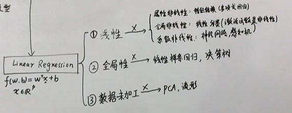
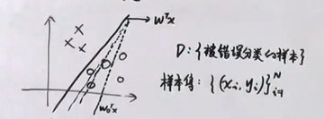
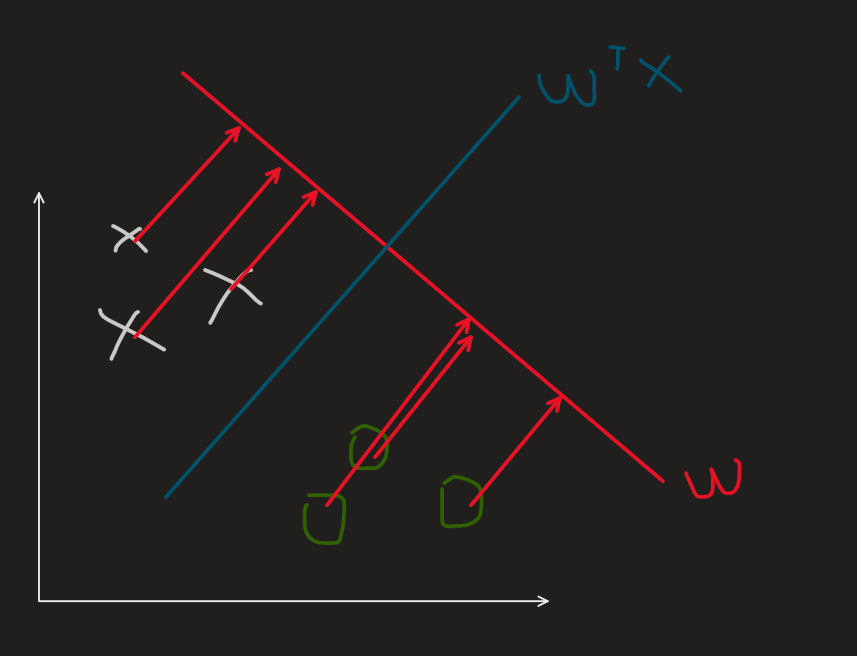
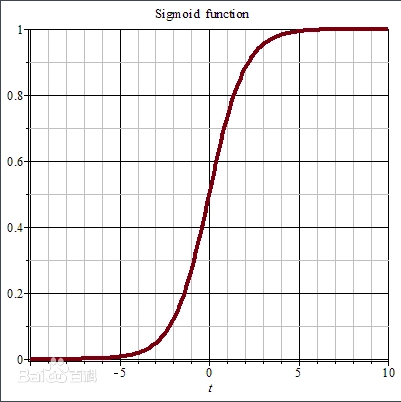
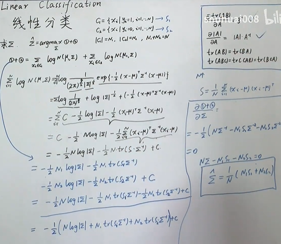

# 线性分类

从线性回归出发，线性回归的三个特点分别是：**线性**、**全局性**、**数据未加工**

打破其中的一个或几个特点从而形成了其他的机器学习模型。

比如打破了**属性线性**的特点即**属性非线性**，就可以变成**特征转换（多项式回归）**

比如打破**全局线性**的特点即**全局非线性**，就变成了**线性分类（激活函数是非线性）**

线性分类，可以看成**线性回归通过激活函数**带来了分类的效果，也可以看作是把数据**降维**然后根据阈值判断类别。

$$
y=f(w^Tx+b),\ y\in = \begin{cases}
  \{0,1\} \\
  [0,1]
\end{cases}
$$

函数$f$就是激活函数$activation\ function$

线性分类也有两种分类，一种是硬分类，一种是软分类

$$
线性分类 \begin{cases}
  硬分类 \ y\in \{0, 1\}  \begin{cases}
    线性判别式 \\
    感知机
  \end{cases} \\
  软分类 \ y\in [0,1] \begin{cases}
    生成式：Gaussian Discriminant Analysis\\
    判别式：Logistic Regression
  \end{cases}
\end{cases}
$$

## 1. 感知机模型（Perceptron Algorithm）

感知机的思想是**错误驱动**。

假定一个数据集是**线性可分**的，如图：

初始化一个$w$，一开始是会有错误分类的，然后根据被错误分类的样本集$D$，一步步优化$w$，直到找到一个正确分类的超平面。

模型表达式：

$$
f(x)=sign(w^Tx) \\
sign(a)=\begin{cases}
  +1,\ a>0 \\
  -1,\ a<0 
\end{cases}
$$

优化策略也是使用一个loss function

$$
L(w)=\sum_{i=1}^{N}I(y_iw^Tx<0)
$$

$I(y_iw^Tx<0)$可以很容易解释，根据$sign(a)$可以知道，当样本正确分类的时候，$w^Tx_i>0, y_i=+1$，$w^Tx_i<0,y_i=-1$。这时两个式子可以合并为一个$y_iw^Tx_i>0$。相反的如果错误分类，则是$y_iw^Tx<0$，所以上面的$I()$是统计错误分类的个数。

但是这个指示函数$I()$的值只有是0，1，不是连续可导的，所以很难求解，需要从另一个角度去求解。所以应该从$y_iw^Tx<0$去看。因为它本身的连续可导的。

所以直接把$y_iw^Tx<0$作为loss function

$$
L(w)=\sum_{x_i\in D} -y_iw^Tx_i
$$

利用随机梯度下降法：

$$
\nabla _w L=-y_ix_i \\
w^{t+1} \leftarrow w^{t} -\lambda \nabla_wL \\
即w^{t+1} \leftarrow w^{t} +\lambda  y_i x_i \\
$$

## 2. 线性判别分析（Linear Discriminant Analysis）

### 2.1 思想

先对数据符号做一些假设（设定）

X是数据特征集合，$N\times p$的矩阵

$$
X=(x_1,x_2,...,x_N)^T = \begin{pmatrix}
  x_1^T\\
  x_2^T\\
  ...\\
  x_N^T
\end{pmatrix}
$$

Y是标签集合，$N\times 1$的矩阵

$$
Y=\begin{pmatrix}
  y_1\\
  y_2\\
  ...\\
  y_N
\end{pmatrix}
$$

数据集可以表示为：
$$
\{ (x_i,y_i) \}_{i=1}^{N}\\
x_i是p维的，y_i\in \{ +1, -1 \}
$$

线性判别分析的思想可以总结为：**类内小，类间大**

实际上可以理解为一个降维再分类的一个过程。

比如上图，可以通过将坐标轴XY上的点映射到红色的坐标轴上变成一维，再选取适合的阈值进行分类。优化目标自然是找到适合投影的一个方向。而从图中，阈值的点，垂直于映射平面的超平面就是所求的分类的超平面，如图蓝色的线。

上面所说的类内小，实际上就是让类内的方差尽量的小，也就是同一类的映射之后越紧凑越好。想法类间大就是不同类之间月松散越好。

### 2.2 loss function 的构建

假设点映射到超平面的值是$z_i=w^Tx_i$

则
$$
\overline{z}=\frac{1}{N}\sum_{i=1}^{N}z_i=\frac{1}{N} \sum_{i=1}^{N} w^Tx_i
$$

$z$的方差可以表示为$S_z$

$$
\begin{aligned}
S_z &= \frac{1}{N}\sum_{i=1}^{N}(z_i-\overline{z})(z_i-\overline{z})^T \\
&= \frac{1}{N}\sum_{i=1}^{N}(w^Tx_i-\overline{z})(w^Tx_i-\overline{z})^T
\end{aligned}
$$

可以把X根据Y的不同分为两个集合，$x_{c1}=\{ x_i|y_i=+1 \}$,$x_{c2}=\{ x_i|y_i=-1 \}$

$|x_{c1}|=N_1$,\ $|x_{c2}|=N_2$, $N_1+N_2=N$

所以可以分别计算$c_1$和$c_2$的均值以及方差$\overline{x_{c_1}}$，$\overline{x_{c_2}}$，$S_{c_1}$，$S_{c_2}$

$$
\begin{aligned}
  c_1:\overline{z_1} &= \frac{1}{N_1}\sum_{i=1}^{N_1}w^Tx_i \\
  S_1 &= \frac{1}{N_1}\sum_{i=1}^{N_1}(w^Tx_i-\overline{z_1})(w^Tx_i-\overline{z_1})^T \\
  c_2:\overline{z_2} &= \frac{1}{N_2}\sum_{i=1}^{N_2}w^Tx_i \\
  S_2 &= \frac{1}{N_2}\sum_{i=1}^{N_2}(w^Tx_i-\overline{z_2})(w^Tx_i-\overline{z_2})^T \\
\end{aligned}
$$

类间大，可以理解为是让$c_1$和$c_2$之间的均值差距大，用$(\overline{z_1}-\overline{z_2})^2$表示

类内小：可以表示为让每个$S$都小，用$S_1+S_2$表示

所以可以构建出目标函数就是

$$
J(w)=\frac{(\overline{z_1}-\overline{z_2})^2}{S_1+S_2} \\
$$

而优化目标就是
$$
\hat{w}=arg\max_w J(w)
$$

将$\overline{Z_1}$, $\overline{Z_2}$, $S_1$,$S_2$都代入$J(w)$进一步推导

$$
\begin{aligned}
J(w) &= \frac{(\overline{z_1}-\overline{z_2})^2}{S_1+S_2} \\
分子 &= ( \frac{1}{N_1}\sum_{i=1}^{N_1}w^Tx_i - \frac{1}{N_2}\sum_{i=1}^{N_2}w^Tx_i )^2 \\
&=[w^T(\frac{1}{N_1}\sum_{i=1}^{N_1}x_i - \frac{1}{N_2}\sum_{i=1}^{N_2}x_i)]^2 \\
&=[w^T(\overline{x_{c_1}} - \overline{x_{c_2}})]^2 \\
&=w^T(\overline{x_{c_1}} - \overline{x_{c_2}})(\overline{x_{c_1}} - \overline{x_{c_2}})^Tw\\
分母&=S_1+S_2 \\
S_1 &= \frac{1}{N_1}\sum_{i=1}^{N_1}(w^Tx_i-\overline{z_1})(w^Tx_i-\overline{z_1})^T \\
&= \frac{1}{N_1}\sum_{i=1}^{N_1}w^T(x_i-\overline{x_{c_1}})(x_i-\overline{x_{c_1}})^Tw \\
&= w^T [\frac{1}{N_1}\sum_{i=1}^{N_1}(x_i-\overline{x_{c_1}})(x_i-\overline{x_{c_1}})^T]w \\
&= w^T S_{c_1}w\\
分母 &=w^T S_{c_1}w+w^T S_{c_2}w \\
&= w^T (S_{c_1}+S_{c_2})w
\end{aligned}
$$

可以得到：

$$
\begin{aligned}
J(w) &=\frac{(\overline{z_1}-\overline{z_2})^2}{S_1+S_2}\\
&= \frac{w^T(\overline{x_{c_1}} - \overline{x_{c_2}})(\overline{x_{c_1}} - \overline{x_{c_2}})^Tw}{w^T (S_{c_1}+S_{c_2})w}  
\end{aligned}
$$

### 2.3 目标函数求解

得到目标函数之后，就可开始对模型进行求解了。

$$
\begin{aligned}
J(w) &=\frac{(\overline{z_1}-\overline{z_2})^2}{S_1+S_2}\\
&= \frac{w^T(\overline{x_{c_1}} - \overline{x_{c_2}})(\overline{x_{c_1}} - \overline{x_{c_2}})^Tw}{w^T (S_{c_1}+S_{c_2})w}  \\
&=\frac{w^TS_bw}{w^TS_ww}
\end{aligned} 
$$

$S_b$：between-class 内类方差

$S_w$：with-class 类内方差

对$J(w)$求导：

$$
\begin{aligned}
  J(w) &= \frac{w^TS_bw}{w^TS_ww} \\
  &= w^TS_bw(w^TS_ww)^{-1}
\end{aligned}
$$

$$
\begin{aligned}
  \frac{\partial{J(w)}}{\partial{w}} &= S_bw(w^TS_ww)^{-1} - w^TS_bw(w^TS_ww)^{-2}S_ww=0 \\  
\end{aligned}
$$

可得：

$$
\begin{aligned}
  w^TS_bwS_ww &=S_bw(w^TS_ww) \\
\end{aligned}
$$

到这一步，可以发现$w^TS_bw$和$(w^TS_ww)$实际上都是实数，所以：

$$
\begin{aligned}
  S_ww &= \frac{w^TS_ww}{w^TS_bw}S_bw \\
  w &= \frac{w^TS_ww}{w^TS_bw}S_w^{-1}S_bw
\end{aligned}
$$

由于这个求解的$w$并不在意它的大小，而是需要求解的是他的一个方向，所以可以忽略实数部分对w方向的影响。进而得到：

$$
\begin{aligned}
w &\propto S_w^{-1}S_bw \\
  &\propto (\overline{x_{c_1}} - \overline{x_{c_2}})(\overline{x_{c_1}} - \overline{x_{c_2}})^Tw \\
  &\propto S_w^{-1}(\overline{x_{c_1}} - \overline{x_{c_2}})
\end{aligned}
$$

从第二行到第三行的变换是同理之上的 因为$(\overline{x_{c_1}} - \overline{x_{c_2}})^Tw$的结果也是一个实数，对求解w的方向来说无影响，直接丢掉。

## 3. 逻辑回归（Logistics Regression）

### 3.1 sigmoid function

如上面感知机所说，线性分类可以是由线性回归加上激活函数变成，而逻辑回归的一个激活函数正是sigmoid函数

$$
\sigma(z)=\frac{1}{1+e^{-z}}
$$

函数图像如下：

不同于感知机的激活函数sign，sigmod是可导的。

使用sigmoid函数的好处：

假设一个二分类问题，使用sigmoid函数后两个类别的概率是这样表达：

$p_0=P(y=0|x)=\sigma(w^Tx)=\frac{1}{1+e^{-w^Tx}},\ y=0$

$p_1=P(y=1|x)=\sigma(w^Tx)=\frac{e^{-w^Tx}}{1+e^{-w^Tx}},\ y=1$

可以发现，这样好好处是使得$p_1$和$p_0$相加一定是=1的，并且$p_1$和$p_0$一定是处于0-1之间的，可以表示为概率。

### 3.2 参数估计

将上面的$p_1$和$p_0$可以合并为一项：

$$
P(y|x) = p_1^yp_0^{1-y}
$$

先设$p_1=\pi(x)$，则$p_0=1 - \pi(x)$

似然函数：

$$
\begin{aligned}
  \prod_{i=1}^{N}[\pi(x_i)]^{y_i}[1-\pi(x_i)]^{1-y_i}
\end{aligned}
$$

对数似然函数：
$$
\begin{aligned}
  L(w) &= \log \prod_{i=1}^{N}[\pi(x_i)]^{y_i}[1-\pi(x_i)]^{1-y_i} \\
  &= \sum_{i=1}^{N} [y_i \log \pi(x_i) + (1-y_i) \log (1-\pi(x_i))] \\
  &= \sum_{i=1}^{N} [\log \frac{\pi(x_i)}{1-\pi(x_i)} + \log (1-\pi(x_i))] \\
  &= \sum_{i=1}^{N} [-y_iw^Tx_i + \log (1+e^{-w^Tx}) ] \\
  &= \sum_{i=1}^{N} -[y_iw^Tx_i - \log (1+e^{-w^Tx}) ]
\end{aligned}
$$

实际上这个可以理解为似然函数也可以理解为是一个loss function，那么目标就很明确了

对似然函数的w求偏导：

$$
\frac{\partial L(w)}{\partial w} = - \sum_{i=1}^{N} (y_ix_i - \frac{x_i e^{w^Tx}}{1+e^{w^Tx_i}}) = 0
$$

然后就是梯度下降法更新权重。。。

$$
w := w+\lambda \sum(y_i - \frac{x_ie^{w^Tx}}{1+e^{w^Tx_i}})
$$

    其实这个地方不太懂，不怎么理解为什么似然函数可以看作是loss function。。。

### 3.3 最大熵模型

逻辑回归的终极目标就是求解最大的$P(Y|X)$

而熵的公式是：$H(P)=-\sum_{x,y}P(x)\log P(x)$

将上面式子替换到熵公式里面：

$$
H(P) = -\sum_{x,y} P(y|x)\log P(y|x)
$$

不是很会。。。。

### 3.4 代码以及实验资料

这里刚好实验课需要写，就东拼西凑了一下。。。大概能写出来。。。不过好像不太靠谱。看看就好。这个实验也包含了朴素贝叶斯的内容，两个写到一起了。懒得分开就凑合着吧。。。

[实验代码链接](../Code/LogisticRegressionAndNaiveBayes.ipynb)

[实验报告](../PDF/LogisticRegressionAndNaiveBayes.pdf)

## 4. 高斯判别分析（Gaussian Discriminant Analysis）

高斯判别分析属于是**概率生成模型**，概率判别模型是主要是求出y=0的概率和y=1的概率$\hat{y}=\argmax_{y\in \{ 0,1 \}} P(y|x)$。

生成模型不是直接求出$P(Y|X)$而关心的是$P(y=0|x)$和$P(y=1|x)$两者谁大，并不是求一个确切的大小，所以可以通过贝叶斯公式$P(y|x)=\frac{P(x|y)P(y)}{P(x)}$去比较大小

而其中的$P(x)$并与y实际上是没有关系的，所以可以得到$P(y|x)\propto P(x|y)P(y)$，而$P(y|x)\propto P(x|y)P(y)$实际上就是联合概率$P(x,y)$，所以主要就是对联合概率进行建模。

所以$P(y)$可以认为是先验prior, $P(y|x)$可以认为是似然likelihood，$P(y|x)$就是后验posterior

也就是让后验最大化

$$
\hat{y} = \argmax_{y\in \{ 0,1 \}} P(y|x) = \argmax_y P(y)P(x|y)
$$

### 4.1 模型定义

高斯判别分析主要是假设$y$满足伯努利分布$y \sim Bernoulli (\Phi)$，很好理解，因为y不是0就是1。假设$x|y$满足高斯分布 $x|y=1 \sim N(\mu_1, \Sigma)$，$x|y=0 \sim N(\mu_2, \Sigma)$

直接写出参数$\theta$的对数似然函数

$$
\begin{aligned}
log-likelihood:l(\theta) &= \log \prod_{i=1}^{N}P(x_i,y_i) \\
&= \sum_{i=1}^{N} \log (P(x_i|y_i P(y_i))) \\
&= \sum_{i=1}^{N} [\log P(x_i|y_i) + \log P(y_i)] \\
&= \sum_{i=1}^{N} [\log N(\mu_1,\Sigma)^{y_i}N(\mu_2,\Sigma)^{1-y_i} + \log \Phi^{y_i}(1-\Phi^{1-y_i})] \\
&= \sum_{i=1}^{N} [\log N(\mu_1,\Sigma)^{y_i} +\log N(\mu_2,\Sigma)^{1-y_i} + \log \Phi^{y_i}(1-\Phi^{1-y_i})] 
\end{aligned}
$$

这里$\theta$可以写成一个元组的形式$\theta=(\mu_1,\mu_2,\Sigma,\Phi)$

求解目标就是$\hat{\theta}=\argmax_\theta l(\theta)$

### 4.2 模型求解

主要就是求解$\theta=(\mu_1,\mu_2,\Sigma,\Phi)$里面是四个参数。

上面已经将对数似然函数推导到三项，$\sum_{i=1}^{N} [\log N(\mu_1,\Sigma)^{y_i} +\log N(\mu_2,\Sigma)^{1-y_i} + \log \Phi^{y_i}(1-\Phi^{1-y_i})]$

从最简单的一项开始，也就是第三项，求$\Phi$：

$$
\begin{aligned}
  ③ &= \sum_{i=1}^{N} [y_i \log \Phi + (1-y_i)\log(1-\Phi)] \\
  \frac{\partial ③}{\partial \Phi} &= \sum_{i=1}^{N} [y_i \frac{1}{\Phi} - (1-y_i)\frac{1}{1-\Phi}] =0 \\
\end{aligned} \\

\begin{aligned}
  &\Rightarrow \sum_{i=1}^{N} [y_i (1-\Phi) - (1-y_i) \Phi] = 0 \\
  &\Rightarrow \sum_{i=1}^{N} (y_i-\Phi) = 0 \\
  &\Rightarrow y_i -N \Phi = 0 \\
  &\Rightarrow \hat{\Phi} = \frac{1}{N} \sum_{i=1}^{N}y_i = \frac{N_1}{N}
\end{aligned}
$$

然后是$\mu_1$和$\mu_2$，两个的求解过程是等价的，求解一个就可以同理得到另一个，求解$\mu_1$：

$$
  \begin{aligned}
    ① &= \sum_{i=1}^{N} \log N(\mu_1, \Sigma)^{y_i}  \\
      &= \sum_{i=1}^{N} y_i \log \frac{1}{(2\pi)^{\frac{p}{2}}|\Sigma|^{\frac{1}{2}}} exp(-\frac{1}{2}(x_i-\mu_1)^T\Sigma^{-1}(x_i-\mu_1))
  \end{aligned}
$$

这里因为是求解$\mu_1$，所以可以省去有$\Sigma$的一项，即：

$$
\mu_1 = \argmax_{\mu_1} ① = \argmax_{\mu_1} \sum_{i=1}^{N} y_i(- \frac{1}{2}(x_i-\mu_1)^T\Sigma^{-1}(x_i-\mu_1))
$$

$$
\begin{aligned}
\Delta &= \sum_{i=1}^{N} y_i(- \frac{1}{2}(x_i-\mu_1)^T\Sigma^{-1}(x_i-\mu_1)) \\
       &= - \frac{1}{2} \sum_{i=1}^{N} y_i (x_i^T \Sigma^{-1} - \mu_1 \Sigma^{-1} )(x_i-\mu_1) \\
       &= - \frac{1}{2} \sum_{i=1}^{N} y_i (x_i^T \Sigma^{-1} x_i - 2 \mu_1 \Sigma^{-1} x_i + \mu_1 \Sigma^{-1} \mu_1)
\end{aligned}
$$

求导：

上面$\Delta$的第一项实际上是一个常数，所以求导过程中可以直接被消去
$$
\begin{aligned}
  &\Rightarrow \frac{\partial \Delta}{\partial \mu_1} = \sum_{i=1}^{N} y_i(\Sigma^{-1}x_i + \Sigma^{-1}\mu_1) = 0 \\
  &\Rightarrow \sum_{i=1}^{N} y_i(\mu_1 - x_i) = 0 \\
  &\Rightarrow \sum_{i=1}^{N} y_i \mu_1 = \sum_{i=1}^{N} y_i x_i \\
  &\Rightarrow \hat{\mu_1} = \frac{\sum_{i=1}^{N} y_i x_i}{\sum_{i=1}^{N} y_i} = \frac{\sum_{i=1}^{N} y_i x_i}{N_1} 
\end{aligned}
$$

同理可得：
$$
\hat{\mu_2} =  \frac{\sum_{i=1}^{N} y_i x_i}{N_2}
$$

然后就是求$\Sigma$

这里不是很能理解直接得到结论吧。。。。

$$
\hat{\Sigma} = \frac{1}{N}(N_1S_1+ N_2S_2)
$$

## 参考资料

[机器学习-白板推导系列(四)-线性分类（Linear Classification）_哔哩哔哩_bilibili](https://www.bilibili.com/video/BV15W41127L2?spm_id_from=333.999.0.0)

[逻辑回归（logistic regression）原理详解_guoziqing506的博客-CSDN博客_逻辑回归原理](https://blog.csdn.net/guoziqing506/article/details/81328402?ops_request_misc=%257B%2522request%255Fid%2522%253A%2522163888824516780255271123%2522%252C%2522scm%2522%253A%252220140713.130102334.pc%255Fall.%2522%257D&request_id=163888824516780255271123&biz_id=0&utm_medium=distribute.pc_search_result.none-task-blog-2~all~first_rank_ecpm_v1~rank_v31_ecpm-3-81328402.pc_search_result_cache&utm_term=%E9%80%BB%E8%BE%91%E5%9B%9E%E5%BD%92&spm=1018.2226.3001.4187)

