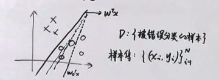
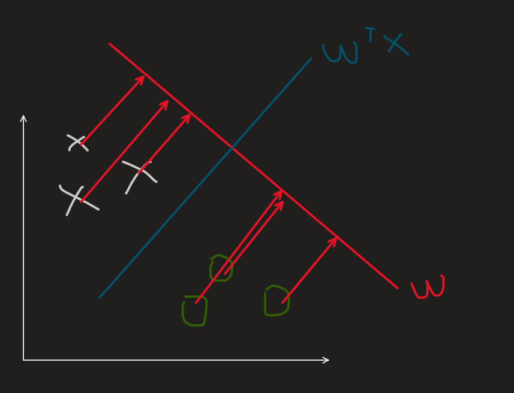

# 线性分类

从线性回归出发，线性回归的三个特点分别是：**线性**、**全局性**、**数据未加工**

打破其中的一个或几个特点从而形成了其他的机器学习模型。

比如打破了**属性线性**的特点即**属性非线性**，就可以变成**特征转换（多项式回归）**

比如打破**全局线性**的特点即**全局非线性**，就变成了**线性分类（激活函数是非线性）**

线性分类，可以看成**线性回归通过激活函数**带来了分类的效果，也可以看作是把数据**降维**然后根据阈值判断类别。

$$
y=f(w^Tx+b),\ y\in = \begin{cases}
  \{0,1\} \\
  [0,1]
\end{cases}
$$

函数$f$就是激活函数$activation\ function$

线性分类也有两种分类，一种是硬分类，一种是软分类

$$
线性分类 \begin{cases}
  硬分类 \ y\in \{0, 1\}  \begin{cases}
    线性判别式 \\
    感知机
  \end{cases} \\
  软分类 \ y\in [0,1] \begin{cases}
    生成式：Gaussian Discriminant Analysis\\
    判别式：Logistic Regression
  \end{cases}
\end{cases}
$$

## 1. 感知机模型

感知机的思想是**错误驱动**。

假定一个数据集是**线性可分**的，如图：

初始化一个$w$，一开始是会有错误分类的，然后根据被错误分类的样本集$D$，一步步优化$w$，直到找到一个正确分类的超平面。

模型表达式：

$$
f(x)=sign(w^Tx) \\
sign(a)=\begin{cases}
  +1,\ a>0 \\
  -1,\ a<0 
\end{cases}
$$

优化策略也是使用一个loss function

$$
L(w)=\sum_{i=1}^{N}I(y_iw^Tx<0)
$$

$I(y_iw^Tx<0)$可以很容易解释，根据$sign(a)$可以知道，当样本正确分类的时候，$w^Tx_i>0, y_i=+1$，$w^Tx_i<0,y_i=-1$。这时两个式子可以合并为一个$y_iw^Tx_i>0$。相反的如果错误分类，则是$y_iw^Tx<0$，所以上面的$I()$是统计错误分类的个数。

但是这个指示函数$I()$的值只有是0，1，不是连续可导的，所以很难求解，需要从另一个角度去求解。所以应该从$y_iw^Tx<0$去看。因为它本身的连续可导的。

所以直接把$y_iw^Tx<0$作为loss function

$$
L(w)=\sum_{x_i\in D} -y_iw^Tx_i
$$

利用随机梯度下降法：

$$
\nabla _w L=-y_ix_i \\
w^{t+1} \leftarrow w^{t} -\lambda \nabla_wL \\
即w^{t+1} \leftarrow w^{t} +\lambda  y_i x_i \\
$$

## 2. 线性判别分析

### 2.1 思想

先对数据符号做一些假设（设定）

X是数据特征集合，$N\times p$的矩阵

$$
X=(x_1,x_2,...,x_N)^T = \begin{pmatrix}
  x_1^T\\
  x_2^T\\
  ...\\
  x_N^T
\end{pmatrix}
$$

Y是标签集合，$N\times 1$的矩阵

$$
Y=\begin{pmatrix}
  y_1\\
  y_2\\
  ...\\
  y_N
\end{pmatrix}
$$

线性判别分析的思想可以总结为：**类内小，类间大**

实际上可以理解为一个降维再分类的一个过程。

比如上图，可以通过将坐标轴XY上的点映射到红色的坐标轴上变成一维，再选取适合的阈值进行分类。优化目标自然是找到适合投影的一个方向。而从图中，阈值的点，垂直于映射平面的超平面就是所求的分类的超平面，如图蓝色的线。

上面所说的类内小，实际上就是让类内的方差尽量的小，也就是同一类的映射之后越紧凑越好。想法类间大就是不同类之间月松散越好。

### 2.2 loss function 的构建

假设点映射到超平面的值是$z_i=w^Tx_i$

则
$$
\overline{z}=\frac{1}{N}\sum_{i=1}^{N}z_i=\frac{1}{N} \sum_{i=1}^{N} w^Tx_i
$$

$z$的方差可以表示为$S_z$

$$
\begin{aligned}
S_z &= \frac{1}{N}\sum_{i=1}^{N}(z_i-\overline{z})(z_i-\overline{z})^T \\
&= \frac{1}{N}\sum_{i=1}^{N}(w^Tx_i-\overline{z})(w^Tx_i-\overline{z})^T
\end{aligned}
$$

可以把X根据Y的不同分为两个集合，$x_{c1}=\{ x_i|y_i=+1 \}$,$x_{c2}=\{ x_i|y_i=-1 \}$

$|x_{c1}|=N_1$,\ $|x_{c2}|=N_2$,\ $N_1+N_2=N$

所以可以分别计算$c_1$和$c_2$的均值以及方差

$$
\begin{aligned}
  c_1:\overline{z_1} &= \frac{1}{N_1}\sum_{i=1}^{N_1}w^Tx_i \\
  S_1 &= \frac{1}{N_1}\sum_{i=1}^{N_1}(w^Tx_i-\overline{z_1})(w^Tx_i-\overline{z_1})^T \\
  c_2:\overline{z_2} &= \frac{1}{N_2}\sum_{i=1}^{N_2}w^Tx_i \\
  S_2 &= \frac{1}{N_2}\sum_{i=1}^{N_2}(w^Tx_i-\overline{z_2})(w^Tx_i-\overline{z_2})^T \\
\end{aligned}
$$

类间大，可以理解为是让$c_1$和$c_2$之间的均值差距大，用$(\overline{z_1}-\overline{z_2})^2$表示

类内小：可以表示为让每个$S$都小，用$S_1+S_2$表示

所以可以构建出目标函数就是

$$
J(w)=\frac{(\overline{z_1}-\overline{z_2})^2}{S_1+S_2} \\
$$

而优化目标就是
$$
\hat{w}=arg\max_w J(w)
$$

将$\overline{Z_1}$, $\overline{Z_2}$, $S_1$,$S_2$都代入$J(w)$进一步推导

$$
\begin{aligned}
J(w) &= \frac{(\overline{z_1}-\overline{z_2})^2}{S_1+S_2} \\
分子 &= ( \frac{1}{N_1}\sum_{i=1}^{N_1}w^Tx_i - \frac{1}{N_2}\sum_{i=1}^{N_2}w^Tx_i )^2 \\
&=[w^T(\frac{1}{N_1}\sum_{i=1}^{N_1}x_i - \frac{1}{N_2}\sum_{i=1}^{N_2}x_i)]^2 \\
&=[w^T(\overline{x_{c_1}} - \overline{x_{c_2}})]^2 \\
&=w^T(\overline{x_{c_1}} - \overline{x_{c_2}})(\overline{x_{c_1}} - \overline{x_{c_2}})^Tw\\
分母&=S_1+S_2 \\
S_1 &= \frac{1}{N_1}\sum_{i=1}^{N_1}(w^Tx_i-\overline{z_1})(w^Tx_i-\overline{z_1})^T \\
&= \frac{1}{N_1}\sum_{i=1}^{N_1}w^T(x_i-\overline{x_{c_1}})(x_i-\overline{x_{c_1}})^Tw \\
&= w^T [\frac{1}{N_1}\sum_{i=1}^{N_1}(x_i-\overline{x_{c_1}})(x_i-\overline{x_{c_1}})^T]w \\
&= w^T S_{c_1}w\\
分母 &=w^T S_{c_1}w+w^T S_{c_2}w \\
&= w^T (S_{c_1}+S_{c_2})w
\end{aligned}
$$

可以得到：

$$
J(w) = \frac{w^T(\overline{x_{c_1}} - \overline{x_{c_2}})(\overline{x_{c_1}} - \overline{x_{c_2}})^Tw}{w^T (S_{c_1}+S_{c_2})w}
$$
