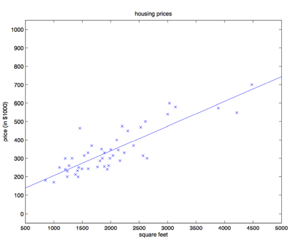
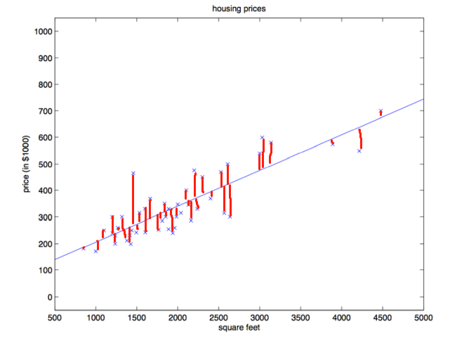
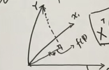
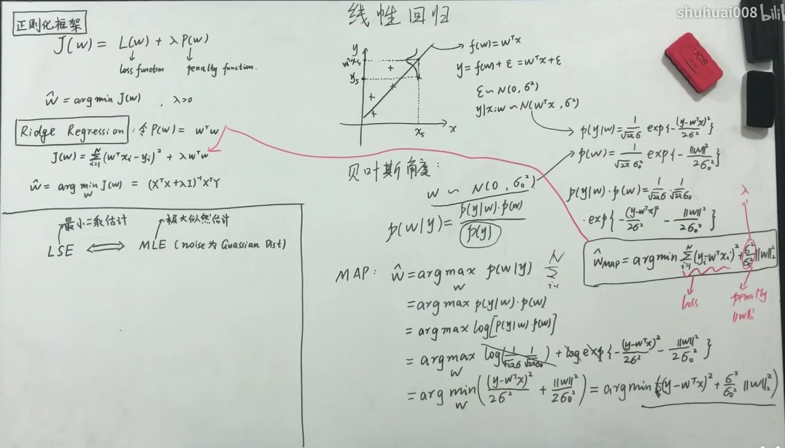

# 线性回归模型

## 1. 字面上理解

如上图的例子中，根据已有的数据，如散点图中的点，求解出一条可以更好拟合效果的曲线，然后根据该曲线预测输入的房屋的价格。这里只用了一个房屋占地面积一个特征，通常可以根据多个特征来更好的预测效果。

## 2. 表达式

将该曲线假设为一个以$x$为变量的线性函数：

$$
f(w)=w_0x_0+w_1x_1+...+w_px_p
$$

这里设数据集$D={(x_1, y_1),(x_2,y_2),...,(x_N,y_N)}$

$x_i$是$p$维的，$y_i$是一维的，$i=1,2,...,N$

$X=(x_1,x_2,...,x_N)^T$

$$
Y=
\begin{pmatrix}
y_1\\
y_2\\
.\\
.\\
.\\
y_N
\end{pmatrix}
$$

拟合函数可以写为：
$$
f(w)=w^Tx
$$

## 3. 损失函数（成本函数 cost function）

给定数据集之后，目标就是求解对于数据集来说最优的参数$w$向量，简单来说就是让该$w$的计算结果更接近真实的$y$。这时就需要一个**损失函数**来衡量$\theta$与更适合的参数之间的距离。

### 3.1 最小二乘估计

矩阵形式的表达式推导：

$$\begin{aligned}
  L(w) &=\sum_{i=1}^{N}||w^Tx_i-y_i||^2 \\
  &=\sum_{i=1}{N}(w^Tx_i-y_i)^2 \\
  &=(w^Tx_1-y_1 \ w^Tx_2-y_2 \ ... \ w^Tx_N-y_N) \begin{pmatrix}
    w^Tx_1-y_1 \\ w^Tx_2-y_2 \\ ... \\ w^Tx_N-y_N \end{pmatrix} \\
  
  &=(w^TX^T - Y^T) (Xw-Y)\\
  &=(w^TX^TXw-2w^TX^TY+Y^TY)
\end{aligned}
$$

最小化$L(w)$：

$$
\begin{aligned}
\hat{w} &= argmin \ L(w) \\
\frac{\partial{L(w)}}{\partial{w}} &= 2X^TXw-2X^TY=0
\end{aligned}
$$

所以：

$$
\begin{aligned}
X^TXw &= X^TY \\
w &= (X^TX)^{-1}X^TY 

\end{aligned}
$$

**最小二乘估计的几何解释：**

如图红线代表着预测点与原数据点之间的距离，根据公式$L(w)$可以容易得出，最小二乘估计的优化目标就是最小化所有红线的长度大小之和

**另一种几何解释：**

将$f(w)=w^Tx$写成是$f(w)=w^T\beta$

此时$x^T$是一个$p$维的行向量，而$\beta$是一个列向量

如图将$x$的每一个维度作为坐标轴，是一个$p$维的子空间，而y则是没有落在（除非是刚好拟合f(w)的Y）该子空间（超平面）的一个向量，而优化的目标就是要找到Y映射到超平面后的向量的长度最小。而这里$X\beta$就是可以理解为是这个$Y$映射到超平面的向量。

从这个角度上，可以得到$Y-X\beta$就是垂直该该平面的一个向量，如图中的虚线表示的。这个向量必定是垂直于这个平面的，也就是垂直于$X$，所以可得得到$X^T(Y-X\beta) = 0$，即可得到$\beta = (X^TX)^{-1}X^TY$。与上面通过最小二乘推导得到的结果是一样的，还省去了推导过程。。。

这里可能理解有问题，自己没有写的很好。。。

**概率视角看最小二乘估计**：

现实数据中是很难有一个$f(w)$可以完全拟合所有的数据，因为数据存在噪声并且噪声也存在一定是随机性，并且这样的一个$f(w)$可能也没有太大的现实意义（考虑过拟合等之类的情况）。 

**假设噪声高斯分布** $\epsilon \sim  N(0, \sigma^2)$

$$
y=f(w) + \epsilon \\
f(w) = w^T + \epsilon \\
y=w^T+\epsilon \\
$$

所以$y|x;w \sim N(w^T, \sigma^2)$

设函数$l(w)$有：

$$
\begin{aligned}
  log \ P(Y|X;w) &= log \prod_{i=1}^{N} P(y_i|x_i;w) \\
  &=\sum_{i=1}^{N}log\ P(y_i|x_i;w) \\
  &=\sum_{i=1}^{N} (log\frac{1}{\sqrt{2\pi}\sigma} -\frac{1}{2\sigma^2}(y_i-w^Tx_i)^2)
\end{aligned}
$$

$$
\begin{aligned}
  \hat{w} &= arg\ max_w l(w) \\
  &= arg\ max_w \ -\frac{1}{2\sigma^2}(y_i-w^Tx_i)^2 \\
  &=arg\ min_w \ (y_i-w^Tx_i)^2
\end{aligned}
$$

结果与一开始得到的结果也是一样的。这里需要注意的是，这里的假设是噪声服从高斯分布

### 3.2 正则化 - 岭回归

上面得到的最小二乘估计式子中$w = (X^TX)^{-1}X^TY$ ，有一些情况是无法适用的，比如当数据量特别小，而数据的特征量很大的时候即$N >> p$，就会造成$(X^TX)^{-1}$有可能是不可逆的。数学上的解释是这样的。

而线性上的解释就是会过拟合，举一个最极端的例子，假设只有一个样本的情况，那会有无数种情况可以去拟合数据，但是没有什么用。。。

一般的过拟合的解决方法主要有三种：

- 加数据
- 特征选择/特征提取（PCA）
- 正则化

正则化可以认为是对参数空间$w$的一个约束。

$$
arg\ min_w \ L(w) + \lambda P(w)
$$

后面一项可以认为是一个惩罚项

正则化的两种范式**L1**和**L2**：

- L1：Lacso $P(w) = ||w||_1$
- L2：Ridge，岭回归 $P(w)=||w||_2^2 =w^Tw$ 也可以所是权值衰减

这里主要对L2进行推导，看结果如何

$$
\begin{aligned}
J(w)  &=\sum_{i=1}^{N}||w^Tx_i-y_i||^2 + \lambda w^Tw\\
  &=(w^TX^T - Y^T) (Xw-Y) + \lambda w^Tw\\
  &=w^T(X^TX + \lambda I)w-2w^TX^TY+Y^TY
\end{aligned}
$$

$$
\hat{w} = arg\ min_w J(w)
$$

$$
\begin{aligned}
\frac{\partial J(w)}{\partial w} &= 2(X^TX+\lambda I)w -X^TY=0 \\
\hat{w} &=(X^TX+\lambda I)^{-1}X^TY
\end{aligned}
$$

**岭回归 - 概率视角：**

这里写不下去了，大概算是理解了就是懒得写了，有空补上。。。。

### 3.3 梯度下降法

梯度下降法简单来说就是一种寻找目标函数最小化的方法。

懒得写了。。。。。。

## 4. 代码复现

刚好实验课需要写，就做了一下代码复现，使用jupyter lab作为编程环境

[源代码链接](../Code/LinearRegression2.ipynb)

[实验报告链接](../PDF/LinearRegression.pdf)

## 5. 参考资料

[机器学习-白板推导系列(三)-线性回归（Linear Regression）_哔哩哔哩_bilibili](https://www.bilibili.com/video/BV1hW41167iL?p=1)

[[中英字幕]吴恩达机器学习系列课程_哔哩哔哩_bilibili](https://www.bilibili.com/video/BV164411b7dx?from=search&seid=16444519961554496773&spm_id_from=333.337.0.0)

CS229 Lecture notes - Andrew Ng