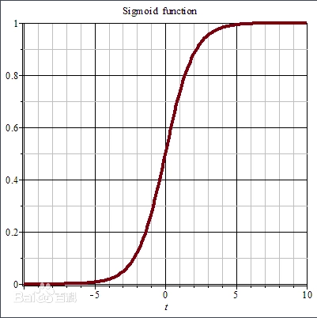

## 3. 逻辑回归（Logistics Regression）

### 3.1 sigmoid function

如上面感知机所说，线性分类可以是由线性回归加上激活函数变成，而逻辑回归的一个激活函数正是sigmoid函数

$$
\sigma(z)=\frac{1}{1+e^{-z}}
$$

函数图像如下：

不同于感知机的激活函数sign，sigmod是可导的。

使用sigmoid函数的好处：

假设一个二分类问题，使用sigmoid函数后两个类别的概率是这样表达：

$p_0=P(y=0|x)=\sigma(w^Tx)=\frac{1}{1+e^{-w^Tx}},\ y=0$

$p_1=P(y=1|x)=\sigma(w^Tx)=\frac{e^{-w^Tx}}{1+e^{-w^Tx}},\ y=1$

可以发现，这样好好处是使得$p_1$和$p_0$相加一定是=1的，并且$p_1$和$p_0$一定是处于0-1之间的，可以表示为概率。

### 3.2 参数估计

将上面的$p_1$和$p_0$可以合并为一项：

$$
P(y|x) = p_1^yp_0^{1-y}
$$

先设$p_1=\pi(x)$，则$p_0=1 - \pi(x)$

似然函数：

$$
\begin{aligned}
  \prod_{i=1}^{N}[\pi(x_i)]^{y_i}[1-\pi(x_i)]^{1-y_i}
\end{aligned}
$$

对数似然函数：
$$
\begin{aligned}
  L(w) &= \log \prod_{i=1}^{N}[\pi(x_i)]^{y_i}[1-\pi(x_i)]^{1-y_i} \\
  &= \sum_{i=1}^{N} [y_i \log \pi(x_i) + (1-y_i) \log (1-\pi(x_i))] \\
  &= \sum_{i=1}^{N} [\log \frac{\pi(x_i)}{1-\pi(x_i)} + \log (1-\pi(x_i))] \\
  &= \sum_{i=1}^{N} [-y_iw^Tx_i + \log (1+e^{-w^Tx}) ] \\
  &= \sum_{i=1}^{N} -[y_iw^Tx_i - \log (1+e^{-w^Tx}) ]
\end{aligned}
$$

实际上这个可以理解为似然函数也可以理解为是一个loss function，那么目标就很明确了

对似然函数的w求偏导：

$$
\frac{\partial L(w)}{\partial w} = - \sum_{i=1}^{N} (y_ix_i - \frac{x_i e^{w^Tx}}{1+e^{w^Tx_i}}) = 0
$$

然后就是梯度下降法更新权重。。。

$$
w := w+\lambda \sum(y_i - \frac{x_ie^{w^Tx}}{1+e^{w^Tx_i}})
$$

    其实这个地方不太懂，不怎么理解为什么似然函数可以看作是loss function。。。

### 3.3 最大熵模型

逻辑回归的终极目标就是求解最大的$P(Y|X)$

而熵的公式是：$H(P)=-\sum_{x,y}P(x)\log P(x)$

将上面式子替换到熵公式里面：

$$
H(P) = -\sum_{x,y} P(y|x)\log P(y|x)
$$

不是很会。。。。

### 3.4 代码以及实验资料

这里刚好实验课需要写，就东拼西凑了一下。。。大概能写出来。。。不过好像不太靠谱。看看就好。这个实验也包含了朴素贝叶斯的内容，两个写到一起了。懒得分开就凑合着吧。。。

[实验代码链接](../Code/LogisticRegressionAndNaiveBayes.ipynb)

[实验报告](../PDF/LogisticRegressionAndNaiveBayes.pdf)
