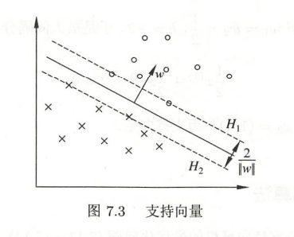
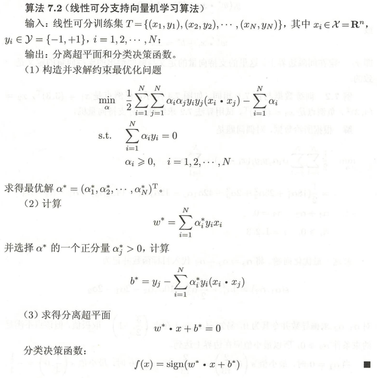
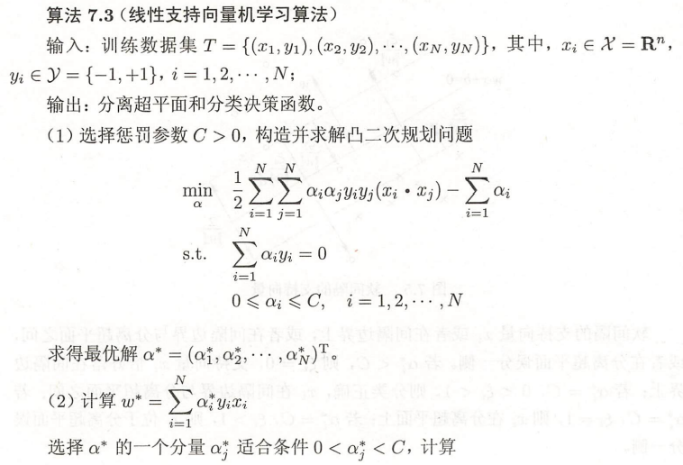
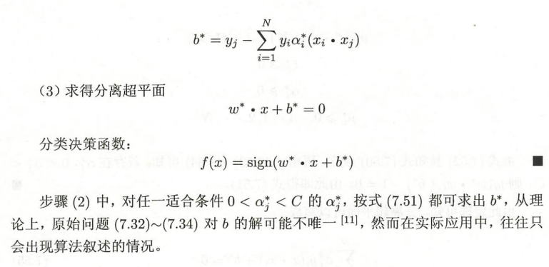
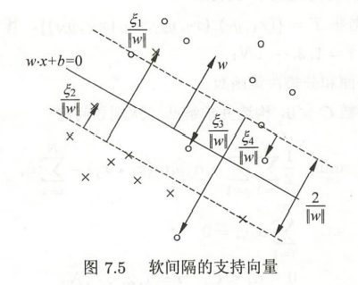
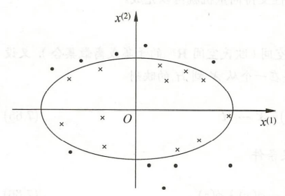
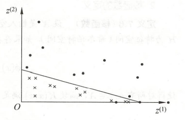

## 支持向量机（support vector machines，SVM）

支持向量机学习方法包含构建有简至繁的模型：**线性可分支持向量机**、**线性支持向量机**以及**非线性支持向量机**。

当数据线性可分时，通过硬间隔最大化，学习一个线性的分类器，即线性可分支持向量机；当数据近似线性可分时，通过软间隔最大化，也可以学习一个线性分类器，即线性支持向量机；当数据线性不可分时，通过核技巧及软间隔最大化，学习非线性支持向量机。

### 线性可分支持向量机

学习目标是在特征空间中找到一个分离超平面，将实例分到不同的类。分离超平面对应方程$wx+b = 0$，由法向量和截距决定，基本和感知机一样。区别于感知机的是，感知机利用误分类最小化的策略，求的分离超平面可以有无穷多个解，**线性可分支持向量机利用间隔最大化求解最优超平面，这样的解是唯一的**。

其实和感知机真的有些像，先学过了感知机再看支持向量机就会有点感觉了。

给定数据集（线性可分），通过间隔最大化得到分离超平面，模型，其实原来还是一个线性函数，然后再套上一个类似激活函数，跟感知机一样的sign：

$$
w^* x + b^* = 0 \\
f(x) = sign(w^* x + b^*)
$$

这就是线性可分的支持向量机

然后就是看如何最大化这个间隔，然后把他转换成最小化问题，以及搞清楚函数间隔和几何间隔。然后SVM使用的几何间隔。

#### 函数间隔和几何间隔

简单来说，间隔，就是点到超平面的距离

函数间隔是这样的$\hat{\gamma_i} = y_i(wx_i+b)$，没有任何约束，然后优化目标就是要找到所有点中，函数间隔最小的一个或几个然后把他们最大化。但是函数间隔有一个问题，比如成比例的同时改变参数为$2w$和$2b$，超平面不会发生改变，但是函数间隔却变了成原来的两倍。

集合间隔就是对函数间隔加以约束，如规范化，$||w|| = 1$，使得间隔是确定的。

#### 间隔最大化

间隔最大化的直观解释：找到间隔最大化的超平面意味着被分隔的训练集分类可信度是最高的，也就是说两类数据来说距离越远，这样的超平面就对新的实例有很好的预测能力。

最大间隔分离超平面可以这样表示成一个**约束最优化问题**：

$$
\max_{w,b} \gamma \\
s.t. \ y_i(\frac{w}{||w||}x_i + \frac{b}{||w||})  \gamma ,\  i=1,2,...,N
$$

也就是希望最大化超平面$(w,b)$关于训练集的几何间隔$\gamma$，约束条件表示超平面关于每个训练样本点的集合间隔至少是$\gamma$

然后还需要考虑到函数间隔和集合间隔的问题

$$
\max_{w,b} \frac{\hat{\gamma}}{||w||} \\
s.t. \ y_i(\frac{w}{||w||}x_i + \frac{b}{||w||})  \hat{\gamma} ,\  i=1,2,...,N
$$

实际上使用函数间隔也不影响最优化问题的解。即使是等比例改变$w$和$b$，函数间隔也会等比例，不过这一改变对优化问题等式约束没有影响。这样的话，如果把$\hat{\gamma}$取为1即$\hat{\gamma} = 1$，代入带上面最优化问题可以得到最大化的是$\frac{1}{||w||}$，然后可以转换成最小化问题$\frac{1}{2}||w||^2$。就得到了线性可分支持向量机学习的最优化问题：

$$
\min_{w,b} \frac{1}{2}||w||^2 \\
s.t. y_i(wx_i+b)-1 >= 0 , \ i=1,2,...,N
$$

变成凸优化问题（虽然不懂凸优化是什么。。。。）

得到最优化问题的解$w^*$,$b^*$就可以得到最大化间隔分离超平面$w^*x+b^*=0$，套上sign函数就是分类决策函数$f(x) = sign(w^*x+b^*)$，也就是线性可分支持向量机模型。

#### 学习算法

#### 支持向量

支持向量实际上就是落在**间隔边界**上的样本点，关于间隔边界的就是约束最优化问题种的约束条件，等号成立的时候，即$y_i(wx_i+b)-1 = 0$。支持向量就是落在两条线上，这两天线之间就是间隔边界。

实际上再决定分类超平面时，只有支持向量起作用，离超平面远的那些点没有作用，甚至可能把这些点直接删掉也不影响结果。

#### 学习的对偶算法

跟感知机一样，SVM也有学习的对偶算法，使得更容易求解。然后SVM使用对偶形式的另一个原因是可以引入和函数，然后推广到非线性分类

由上述式子得到拉格朗日函数（没学仔细学过但是大概知道有这么一个公式能用。。。）：

$$
L(w,b,\alpha) = \frac{1}{2}||w||^2 - \sum_{i=1}^{N}\alpha_iy_i(wx_i+b)+\sum_{i=1}^{N}\alpha_i
$$

其中的$\alpha = (\alpha_1,\alpha_2,...,\alpha_N)^T$是拉格朗日乘子向量。

原始问题的对偶问题是极大极小问题：

$$
\max_\alpha \min_{w,b} L(w,b,\alpha)
$$

要先对$L(w,b,\alpha)$求$w,b$的极小，然后再对$\alpha$求极大。

求偏导 = 0：

$$
\begin{aligned}
  &\nabla_wL(w,b,\alpha) = w - \sum_{i=1}^{N}\alpha_iy_ix_i = 0 \\
  &\nabla_bL(w,b,\alpha) = - \sum_{i=1}^{N}\alpha_iy_i=0
\end{aligned}
$$

得到：

$$
\begin{aligned}
  & w = \sum_{i=1}^{N}\alpha_iy_ix_i \\ 
  & \sum_{i=1}^{N}\alpha_iy_ix_i
\end{aligned}
$$

带入到拉格朗日函数，最后简化得到：

$$
\min_{w,b}L(w,b,\alpha) = - \frac{1}{2} \sum_{i=1}^{N} \sum_{j=1}^{N} \alpha_i\alpha_jy_iy_j(x_ix_j) + \sum_{i=1}^{N}\alpha_i
$$

求$\min_{w,b}(w,b,\alpha)$ 对$\alpha$的极大，即是对偶问题

$$
\begin{aligned}
  & \max_\alpha - \frac{1}{2} \sum_{i=1}^{N} \sum_{j=1}^{N} \alpha_i \alpha_j y_i y_j (x_i x_j) + \sum_{i=1}^{N} \alpha_i \\
  & s.t. \  \sum_{i=1}^{N} \alpha y_i = 0 \\
  & \alpha_i >= 0, \ i=1,2,...,N
\end{aligned}
$$

转换成求极小的等价问题：

$$
\begin{aligned}
  & \min_\alpha  \frac{1}{2} \sum_{i=1}^{N} \sum_{j=1}^{N} \alpha_i \alpha_j y_i y_j (x_i x_j) - \sum_{i=1}^{N} \alpha_i \\
  & s.t. \  \sum_{i=1}^{N} \alpha y_i = 0 \\
  & \alpha_i >= 0, \ i=1,2,...,N
\end{aligned}
$$

通过定理C.3 看KT条件成立，可以得到原始最优化问题的解$w^*,b^*$：

$$
\begin{aligned}
  & w^* = \sum_{i=1}^{N} \alpha_i^*y_ix_i \\
  & b^* = y_i - \sum_{i=1}^{N}\alpha_i^*y_i(x_ix_j)
\end{aligned}
$$

分类决策最后写出来就是：

$$
f(x) = sign(\sum_{i=1}^{N}\alpha_i^*y_i(xx_i)+b^*)
$$

可以看到线性可分支持向量机种，$w^*和b^*$只依赖于训练集种对应于$\alpha_i^*>0$ 的样本点 $(x_i,x_j)$，而其他样本点对 $w^*$ 和 $b^*$没有影响。$\alpha_i^*>0$的实例点$x_i \in R^n$ 称之为支持向量。

### 线性支持向量机（软间隔最大化）

很多时候，数据都是线性不可分的，存在一些噪声或特异点，出去这些点后大部分样本还是基本线性可分的。对于这样的数据集，就可以使用软间隔最大化来学习。

#### 原始形式

对硬间隔最大化的约束条件再引进一个松弛变量$\xi >= 0$，使函数间隔加上松弛变量大于等于1。这样约束条件变为

$$
y_i(wx_i+b) \geq 1 - \xi_i
$$

同时，对每个松弛变量$\xi_i$，支付一个代价$\xi_i$。目标函数由原来的$\frac{1}{2}||w||^2$变成

$$
\frac{1}{2}||w||^2 + C\sum_{i=1}^{N}\xi_i
$$

这里，$C>0$ 称为惩罚参数，一般由应用问题决定，$C$ 值大时对误分类的惩罚增大，$C$ 值小对误分类惩罚减小。

优化问题变成：

$$
\begin{aligned}
  &\min_{w,b,\xi} \frac{1}{2}||w||^2 + C \sum_{i=1}^{N}\xi_i \\
  &s.t.\ y_i(wx_i+b) \geq 1 - \xi_i, \ i=1,2,...,N\\
  &\xi \geq 0, \ i=1,2,...,N
\end{aligned}
$$

$(w,b,\xi)$的解是存在的，可以证明$w$的解是唯一的，但$b$的解可能不唯一，而是存在一个区间。

最后得到的分离超平面和分类决策函数还是一样的。

$$
w^* x + b^* = 0 \\
f(x) = sign(w^*x + b)
$$

#### 对偶形式

对偶问题如下：

$$
\begin{aligned}
  & \min_\alpha \frac{1}{2} \sum_{i=1}^{N}\sum_{j=1}^{N} \alpha_i\alpha_jy_iy_j(x_ix_j) - \sum_{i=1}^{N}\alpha_i \\
  & s.t. \ \sum_{i=1}^{N}\alpha_iy_i=0 \\
  & 0 \leq \alpha_i \leq C,\ i=1,2,...,N
\end{aligned}
$$

拉格朗日函数：

$$
\begin{aligned}
  &L(w,b,\xi,\alpha,\mu) = \frac{1}{2}||w||^2 + C \sum_{i=1}^{N}\xi_i - \sum_{i=1}^{N}\alpha_i(y_i(wx_i+b)-1+\xi_i) - \sum_{i=1}^{N}\mu_i\xi_i \\
  &其中，\alpha_i \geq 0, \mu_i \leq 0
\end{aligned}
$$
对$w,b,\xi$分别求偏导得到：

$$
\begin{aligned}
  & w = \sum_{i=1}^{N}\alpha_iy_ix_i \\
  & \sum_{i=1}^{N}\alpha_iy_i = 0 \\
  & C - \alpha_i - \mu_i = 0
\end{aligned}
$$

代回到拉格朗日函数得到：

$$
\min_{w,b,\xi} L(w,b,\xi,\alpha,\mu) = - \frac{1}{2} \sum_{i=1}^{N} \sum_{j=1}^{N} \alpha_i\alpha_jy_iy_j(x_ix_j) + \sum_{i=1}^{N} \alpha_i
$$

再求$\alpha$的极大，得对偶问题：

$$
\max_\alpha - \frac{1}{2} \sum_{i=1}^{N} \sum_{j=1}^{N} \alpha_i \alpha_j y_i y_j (x_i x_j) + \sum_{i=1}^{N} \alpha_i \\
\begin{aligned}
   s.t. \   & \sum_{i=1}^{N} \alpha_i y_i = 0 \\  
            & C - \alpha_i - \mu_i = 0 \\ 
            & \alpha_i \geq 0 \\
            & \mu_i \geq 0, \ i=1,2,...,N
\end{aligned}
$$

消去$\mu$约束条件变成

$$
0 \leq \alpha_i \leq C
$$

求得对偶问题之后，可以求得原始形式的解：

$$
\begin{aligned}
  w^* &= \sum_{i=1}^{N} \alpha_i^* y_i x_i \\
  b^* &= y_j - \sum_{i=1}^{N} y_i \alpha_i^* (x_i x_j)
\end{aligned}
$$

那分离超平面就是

$$
\sum_{i=1}^{N} \alpha_i^* y_i(xx_i) + b^* = 0
$$

分类决策函数：

$$
f(x) = sign(\sum_{i=1}^{N} \alpha_i^* y_i(x x_i) + b^*)
$$

#### 学习算法

对偶问题的解$\alpha^* = (\alpha_1^*,\alpha_2^*,...,\alpha_N^*)^T$中$\alpha_i^* > 0$的样本点$(x_i,y_i)$的实例$x_i$称之为支持向量，比硬间隔复杂了一点，支持向量机可能在间隔边界上，也可能在间隔边界与超平面之间。

$\alpha_i^* < C$，则$\xi_i = 0$，支持向量$x_i$刚好落在间隔边界上；$\alpha_i^* = C, 0< \xi_i <1$，则分类正确，$x_i$在间隔边界与分类超平面之间；$\alpha_i^* = C, \xi_i = 1$则$x_i$在分离超平面上；$\alpha_i^* = C, \xi_i >1$，则$x_i$位于分离超平面误分一侧。

#### 合页损失函数

另一种解释线性支持向量机学习的方法，就是最小化这个目标函数：

$$
\sum_{i=1}^{N} [1-y_i(wx_i+b)]_+ + \lambda||w||^2
$$

第二项是正则化项，使用L2范式，第一项是经验损失或经验风险，$L(y(wx+b)) = [1-y(wx+b)]_+$

称为合页损失函数（hinge loss function）。下标“+”表示以下正取正值的函数。

$$
[z]_+ = \begin{cases}
  z,\ z > 0 \\
  0,\ z \leq 0
\end{cases}
$$

大概就是样本点被正确分类的确信度大于1损失读就是0，否则就是$1-y_i(wx_i+b)$。

最后等价的最优化问题是：

$$
\min_{w,b} \sum_{i=1}^{N} [1-y_i(wx_i+b)]_+ + \lambda||w||^2
$$

这部分懒得看了。。。

### 非线性支持向量机与核函数

当数据集是非线性的，使用非线性支持向量机可能可以搞定。非线性支持向量机主要特点就是利用**核技巧（kernel trick）**。

#### 核技巧

非线性分类问题，大概就是无法利用线性模型对正负例样本进行正确分类。比如下图，可以无法用一条直线做分隔，但是用一个椭圆就可以轻松分离两类。

对于给定的一个训练集，如果能用$R^n$中的一个超曲面将正负例正确分开，则称这个问题为非线性可分问题。

非线性变换一般不太好直接求解，采用的方法是进行一个非线性变换，将非线性问题变成线性问题，通过解变换后的线性问题的方法求解原来的非线性问题。如下图，就是把上图的变成下图再通过线性求解。也就是特征空间的变换

也就是使用一个变换将原空间的数据映射到新空间，然后在新空间里用线性分类学习方法从训练集中学习分类模型。核技巧就是这样的方法。

**核函数**

设$\chi$是输入空间，$\Eta$为特征空间，如果存在一个从$\chi$到$\Eta$的映射

$$
\phi(x):\chi \rightarrow \Eta
$$

使得所有$x,z \in \chi$, 满足$K(x,z)$满足条件

$$
K(x,z) = \phi(x) \phi (z)
$$

则称$K(x,z)$为核函数，$\phi$为映射函数，式中$\phi(x)\phi(z)$为$\phi(x)$和$\phi(z)$的内积。

