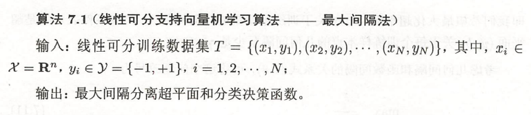
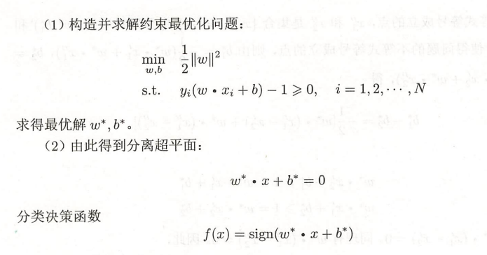

## 支持向量机（support vector machines，SVM）

支持向量机学习方法包含构建有简至繁的模型：**线性可分支持向量机**、**线性支持向量机**以及**非线性支持向量机**。

当数据线性可分时，通过硬间隔最大化，学习一个线性的分类器，即线性可分支持向量机；当数据近似线性可分时，通过软间隔最大化，也可以学习一个线性分类器，即线性支持向量机；当数据线性不可分时，通过核技巧及软间隔最大化，学习非线性支持向量机。

### 线性可分支持向量机

学习目标是在特征空间中找到一个分离超平面，将实例分到不同的类。分离超平面对应方程$wx+b = 0$，由法向量和截距决定，基本和感知机一样。区别于感知机的是，感知机利用误分类最小化的策略，求的分离超平面可以有无穷多个解，**线性可分支持向量机利用间隔最大化求解最优超平面，这样的解是唯一的**。

其实和感知机真的有些像，先学过了感知机再看支持向量机就会有点感觉了。

给定数据集（线性可分），通过间隔最大化得到分离超平面，模型，其实原来还是一个线性函数，然后再套上一个类似激活函数，跟感知机一样的sign：

$$
w^* x + b^* = 0 \\
f(x) = sign(w^* x + b^*)
$$

这就是线性可分的支持向量机

然后就是看如何最大化这个间隔，然后把他转换成最小化问题，以及搞清楚函数间隔和几何间隔。然后SVM使用的几何间隔。

**函数间隔和几何间隔**：

简单来说，间隔，就是点到超平面的距离

函数间隔是这样的$\hat{\gamma_i} = y_i(wx_i+b)$，没有任何约束，然后优化目标就是要找到所有点中，函数间隔最小的一个或几个然后把他们最大化。但是函数间隔有一个问题，比如成比例的同时改变参数为$2w$和$2b$，超平面不会发生改变，但是函数间隔却变了成原来的两倍。

集合间隔就是对函数间隔加以约束，如规范化，$||w|| = 1$，使得间隔是确定的。

**间隔最大化：**

间隔最大化的直观解释：找到间隔最大化的超平面意味着被分隔的训练集分类可信度是最高的，也就是说两类数据来说距离越远，这样的超平面就对新的实例有很好的预测能力。

最大间隔分离超平面可以这样表示成一个**约束最优化问题**：

$$
\max_{w,b} \gamma \\
s.t. \ y_i(\frac{w}{||w||}x_i + \frac{b}{||w||})  \gamma ,\  i=1,2,...,N
$$

也就是希望最大化超平面$(w,b)$关于训练集的几何间隔$\gamma$，约束条件表示超平面关于每个训练样本点的集合间隔至少是$\gamma$

然后还需要考虑到函数间隔和集合间隔的问题

$$
\max_{w,b} \frac{\hat{\gamma}}{||w||} \\
s.t. \ y_i(\frac{w}{||w||}x_i + \frac{b}{||w||})  \hat{\gamma} ,\  i=1,2,...,N
$$

实际上使用函数间隔也不影响最优化问题的解。即使是等比例改变$w$和$b$，函数间隔也会等比例，不过这一改变对优化问题等式约束没有影响。这样的话，如果把$\hat{\gamma}$取为1即$\hat{\gamma} = 1$，代入带上面最优化问题可以得到最大化的是$\frac{1}{||w||}$，然后可以转换成最小化问题$\frac{1}{2}||w||^2$。就得到了线性可分支持向量机学习的最优化问题：

$$
\min_{w,b} \frac{1}{2}||w||^2 \\
s.t. y_i(wx_i+b)-1 >= 0 , \ i=1,2,...,N
$$

变成凸优化问题（虽然不懂凸优化是什么。。。。）

得到最优化问题的解$w^*$,$b^*$就可以得到最大化间隔分离超平面$w^*x+b^*=0$，套上sign函数就是分类决策函数$f(x) = sign(w^*x+b^*)$，也就是线性可分支持向量机模型。

**学习算法**：

**学习的对偶算法**：

